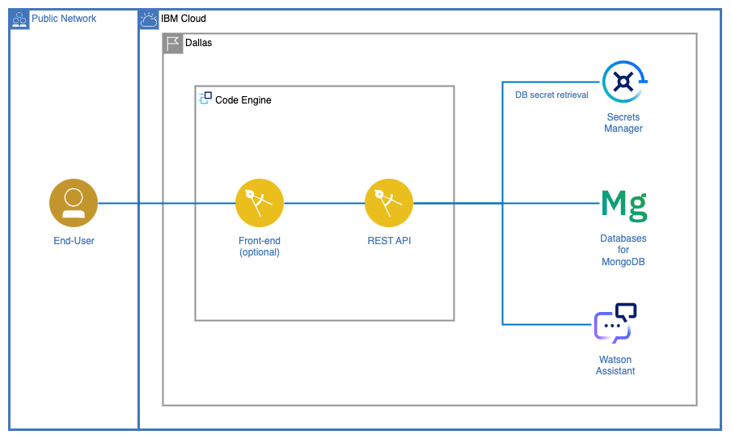

# Watson Airlines Customer Experience

- [Watson Airlines Customer Experience](#watson-airlines-customer-experience)
  - [1. Introduction](#1-introduction)
    - [1.1. About Watson Airlines](#11-about-watson-airlines)
    - [1.2. Business Challenge](#12-business-challenge)
  - [2. About Solution](#2-about-solution)
    - [2.1. Application Architecture](#21-application-architecture)
    - [2.2. Repository Structure](#22-repository-structure)
    - [2.3. Virtual Assistant conversation prompts](#23-virtual-assistant-conversation-prompts)
    - [2.4. Implementation Considerations](#24-implementation-considerations)
  - [3. Database specifications](#3-database-specifications)
    - [3.1. Flights](#31-flights)
    - [3.2. Airports](#32-airports)
    - [3.3. Airlines](#33-airlines)
  - [4. Environment Setup](#4-environment-setup)
    - [4.0. Prerequisites](#40-prerequisites)
    - [4.1. Environment variables](#41-environment-variables)
    - [4.2. MongoDB Connection](#42-mongodb-connection)
  - [5. Solution Deployment \& Configuration](#5-solution-deployment--configuration)
    - [5.1. Application Deployment on IBM Code Engine](#51-application-deployment-on-ibm-code-engine)
    - [5.2. Watson Assistant Conversation Flow](#52-watson-assistant-conversation-flow)
    - [5.3. Custom Extensions on Watson Assistant](#53-custom-extensions-on-watson-assistant)
    - [5.4. OpenAPI specification generation](#54-openapi-specification-generation)
      - [5.4.1. What is OpenAPI?](#541-what-is-openapi)
      - [5.4.2. Generating the specification](#542-generating-the-specification)
  - [6. Project Delivery](#6-project-delivery)
    - [6.1. Deliverables](#61-deliverables)
    - [6.2. Focal Points](#62-focal-points)
  - [References](#references)
  - [Authors](#authors)

## 1. Introduction

### 1.1. About Watson Airlines

Watson Airlines is a one of the largest airlines in America. With over 30 years of history, we connect people to opportunities while expanding the understanding of our planet and the people within it. We offer our one-of-a-kind value and Hospitality at over 50 airports across more than 15 countries. In addition, we are members of the [International Air Transport Association (IATA)](https://www.iata.org/en/about/), a trade association that represents over 300 airlines, equivalent to about 83% of total air traffic. This allows us to operate safely, securely, efficiently, and economically under clearly defined rules.

We are pioneers in the usage of technology, and actively advocate for its usage to improve our customer's experience.

### 1.2. Business Challenge

Watson Airlines wishes to provide its clients with a better user experience, focused on ease of use and customer self-service. One of their biggest difficulties at the moment is providing information to passengers about existing flights, departure times, and possible delays. Clients find obtaining this information is difficult, and Watson Airlines is unable to provide efficient-enough assistance with their existing personnel.

To solve this problem, Watson Airlines wishes to implement a *Virtual Assistant* to provide answers to clients via chat. Virtual Assistants are able to communicate fluidly with users and can be integrated with multiple channels to serve a wider array of clients, an advantage in respect to their current channels (in-person and telephony services).

To develop this solution, Watson Airlines is willing to provide access to a database containing information on flights from both its company and others as well as their corresponding airports, both shared by IATA as part of their alliance.

## 2. About Solution

### 2.1. Application Architecture



Expected application flow is as follows:

1. End-user accesses web application via Internet. See **note** below for more details.
2. [Watson Assistant](https://cloud.ibm.com/docs/assistant?topic=assistant-index) chatbot greets user. Conversation proceeds as expected. See [Virtual Assistant conversation prompts](#23-virtual-assistant-conversation-prompts) for more information regarding the Virtual Assistant's expected responses in different scenarios.
3. When users requests information stored on an external database, Watson Assistant will invoke a REST API to retrieve the data.
4. The REST API will connect to the external database, a [Databases for MongoDB](https://www.ibm.com/cloud/databases-for-mongodb) (DBaaS) instance on IBM Cloud, and execute a query. The REST API shall be deployed on IBM Cloud's Code Engine. It's source code must be stored on this repository's [source folder](./source/).
5. Data will be sent back from the REST API to Watson Assistant and displayed to the user on the interactive chat window.

**Note:** web application implementation is *optional*. Accessing the chatbot via the Watson Assistant GUI on IBM Cloud is acceptable, though not desirable. Should it be implemented, however, it must be deployed on IBM Cloud's Code Engine on the same project as the REST API.

### 2.2. Repository Structure

```
.
├── assets/               # Documentation Assets
├── images/               # Images used in the present document
├── source/               # Application source code
│   ├── back-end/         # REST API
│   │   └── sample/       # Development Assets & Samples
│   └── front-end/        # Web application front-end (optional)
└── README.md             # Present document
```

### 2.3. Virtual Assistant conversation prompts

Watson Airlines requires the virtual assistant be able to answer the following queries:

1. **Associated Airlines**. Will answer with the list of airlines associated with the initiative, all of them located under the 'Airlines' collection within the database.
2. **About Watson Airlines**. Will provide a short description about Watson Airlines. The information shall be obtained from the [About Watson Airlines](#11-about-watson-airlines) section of this document.
3. **Search for Flights**. Customers will be able to request a list of available flights based on the following criteria:
   1. Origin Airport (IATA code) & Destination Airport (IATA code)
   2. Departure Date (date range in format `mm-yyyy-dd`). *Tip:* To reduce query results, it's recommended to request additional parameters, such as airline or origin/destination airports.
4. **Request Flight information**. Customers shall be able to obtain information about a specific flight. *Tip:* this operation can be done by performing a search by Object ID.

### 2.4. Implementation Considerations

- While JavaScript/NodeJS is the preferred programming language, any might be used for developing both the REST API and Web Application.
- Virtual Assistant language might be either English or Spanish.
- Environment variables established in [this document](#41-environment-variables) must be respected. However, additional ones might be defined if deemed necessary.
- Access credentials to both the Database and Secret Manager instances will be provided to you via e-mail.
- All source code must be located under the [source folder](./source/). REST API code shall be put under [back-end](./source/back-end/) and Web Application code (if implemented) under [front-end](./source/front-end/). You are free to structure these folder as you see fit, but know that clarity and order will be taken into account when evaluating the implementation.

## 3. Database specifications

### 3.1. Flights

Flight data stored on the database can be located under the `flights` collection and contains the following information:

- `AIRLINE` (String) - Airline Identifier.
- `FLIGHT_NUMBER` (Number) - Flight Identifier.
- `ORIGIN_AIRPORT` (String) - Starting Airport (IATA Code).
- `DESTINATION_AIRPORT` (String) - Destination Airport (IATA Code).
- `CANCELLED` (Boolean) - Indicates whether flight was cancelled.
- `DEPARTURE_DATE` (Date) - Flight Departure Date & Time. Format *yyyy-mm-dd hh:mm:ss*.
- `ARRIVAL_DATE` (Date) - Flight Arrival Date & Time. Format *yyyy-mm-dd hh:mm:ss*.

Example:

```json
{
    "_id": "63e53b3f123da255099f3700",
    "AIRLINE": "WA",
    "FLIGHT_NUMBER": 185,
    "ORIGIN_AIRPORT": "OGG",
    "DESTINATION_AIRPORT": "HNL",
    "CANCELLED": true,
    "DEPARTURE_DATE": "2023-01-01T14:45:00.000Z",
    "ARRIVAL_DATE": "2023-01-01T15:21:00.000Z"
}
```

### 3.2. Airports

Airport data can be found under the `airports` collection, which contains:

- `IATA_CODE` (String) - Location Identifier.
- `AIRPORT` (String) - Airport's Name.
- `CITY` (String) - Airport's City.
- `STATE` (String) - Airport's State.
- `COUNTRY` (String) - Airport's Country.

Example:

```json
{
  "_id": "63dd87f9fd4b3618756969be",
  "IATA_CODE": "ABE",
  "AIRPORT": "Lehigh Valley International Airport",
  "CITY": "Allentown",
  "STATE": "PA",
  "COUNTRY": "USA"
}
```

### 3.3. Airlines

Air Line data can be found under the `airlines` collection, which contains:

- `IATA_CODE` (String) - Airline's Identifier.
- `AIRLINE` (String) - Airline's Name.

Example:

```json
{
  "_id": "63dd87e1fd4b3618756969bc",
  "IATA_CODE": "WA",
  "AIRLINE": "Watson AirLines"
}
```

> The provided information was generated based on the "2015 Flight Delays and Cancellations" dataset. For more information visit the [Kaggle website](https://www.kaggle.com/datasets/usdot/flight-delays).

## 4. Environment Setup

### 4.0. Prerequisites

- If using the [sample code](./source/back-end/sample/) found on this repository, installing [NodeJS](https://nodejs.org/en/download/) is required.
- If using containers, a container runtime will need to be installed. Recommendations are [Docker](https://docs.docker.com/get-docker/) and [Podman](https://podman.io/getting-started/installation).
- Should you wish to connect to the database via GUI, a MongoDB-compatible client is needed. [Compass](https://www.mongodb.com/docs/compass/current/install/) is recommended. **Note:** to connect to the Database instance, TLS/SSL certificate is required. Visit the [Compass documentation](https://www.mongodb.com/docs/compass/current/connect/advanced-connection-options/tls-ssl-connection/) to learn how to configure it when connecting.
- Access to [IBM Cloud](https://cloud.ibm.com/) will be required for application deployment. This will be provided to you via e-mail.

### 4.1. Environment variables

Environment variables are dynamic values that can be stored and used by different processes on a Operative System (OS). They allow for values to be defined externally, without having to access the application's source code.

The application's environment variables are the following.

- `MONGO_DB_URI`. Databases for MongoDB URI connection string. Example format: `mongodb://$USERNAME:$PASSWORD@$HOSTNAME:$PORT/$DATABASE?$PARAMS`.
- `SECRET_MANAGER_APIKEY`. Secrets Manager instance API Key. Created from the API Keys sub-section under [IAM on IBM Cloud](https://cloud.ibm.com/iam/apikeys).
- `SECRET_MANAGER_URL`. Secrets Manager instance URL. Obtained from the `Endpoints` section under the Certificate Manager instance on IBM Cloud.
- `SECRET_MANAGER_CERT_ID`. Certificate ID in the Secrets Manager instance. Obtained from the certificate's details within IBM Cloud.

> **Note:** This information will be provided to you.

Once you have this information, you must create a `.env` file where your code is located. See the [`.example.env`](./source/.example.env) file for reference.

Afterwards, you must load those variables into your code. There are several packages available depending on your programming language. For JavaScript, for instance, the most popular one is [dotenv](https://www.dotenv.org/).

### 4.2. MongoDB Connection

Download the `.zip` file containing the [environment variables](#41-environment-variables) previously mentioned, and un-compress its contents in your code's source folder.

A [sample code](./source/back-end/sample/sample.mongodb.js) has been provided to you, so it can be imported into your application. To make sure it works properly, you must first install its dependencies, namely `mongoose` and `dotenv`. You can do this by running: `npm install` from the code's directory.

Then, from your code, load the environment variables and invoke the `create_connection()` function, which will automatically connect to MongoDB. See an example below:

```javascript
const path = require("path");
const mongoose = require('mongoose');
const mongo = require("./sample.mongodb");

async function main(){

    // Get global variables from .env file
    require("dotenv").config({path: path.resolve(__dirname,".env")});

    // Connect to database
    const { create_connection } = require("./sample.mongodb");
    await create_connection();    
    
    ...    
}

main();
```

The console will display a `MongoDB connection successful.` message. Afterwards, you can access MongoDB's data, specified in a [previous section](#3-database-specifications), by using mongoose's [schemas](https://mongoosejs.com/docs/guide.html). A [sample](./source/back-end/sample/sample.schema.js) definition has been provided for you. You can import this sample and invoke mongo operations from it. 

See an example for listing a schema's objects below:

```javascript
const Sample = require("./sample.schema");

async function sample_schema(){

  console.log(await Sample.find({}));

}
```

Should you desire to connect to MongoDB using Compass or similar offerings, you must obtain the TLS secret from the Secrets Manager instance. To do so, use the `GET /api/v2/secrets` endpoint to obtain the secret, by it's ID. This value has been provided to you.

See the [Secret Manager API Docs](https://cloud.ibm.com/apidocs/secrets-manager/secrets-manager-v2) for more information.

## 5. Solution Deployment & Configuration

### 5.1. Application Deployment on IBM Code Engine

In order to associate your REST API with the Virtual Assistant, or offer users a Web Application to interact with, you must first make them available online. The easiest way to do this is to [deploy them as applications](https://cloud.ibm.com/docs/codeengine?topic=codeengine-application-workloads) using IBM Code Engine. You can do so by referencing:

1. A container image, previously hosted on a [public repository](https://cloud.ibm.com/docs/codeengine?topic=codeengine-deploy-app) like DockerHub, or a [private one](https://cloud.ibm.com/docs/codeengine?topic=codeengine-deploy-app-private) such as [IBM's Container Registry](https://cloud.ibm.com/docs/codeengine?topic=codeengine-deploy-app-crimage). 
2. Your application's [source code](https://cloud.ibm.com/docs/codeengine?topic=codeengine-app-source-code) directly. If choosing this method, using a [Dockerfile](https://cloud.ibm.com/docs/codeengine?topic=codeengine-dockerfile) to automatically build the image is recommended. See the [Dockerfile reference](https://docs.docker.com/engine/reference/builder/) for more information.

After deploying, you can test it using an API development tool such as [Postman](https://www.postman.com/), and [view the app's logs](https://cloud.ibm.com/docs/codeengine?topic=codeengine-view-logs) on Code Engine.

> **Note:** remember to include environment variables in your deployment. For more information, see how to [work with environment variables](https://cloud.ibm.com/docs/codeengine?topic=codeengine-envvar). To ensure application security, credentials should be [stored as secrets](https://cloud.ibm.com/docs/codeengine?topic=codeengine-configmap-secret).

### 5.2. Watson Assistant Conversation Flow

After creating the Virtual Assistant, the next step will be to [create and configure actions](https://cloud.ibm.com/docs/watson-assistant?topic=watson-assistant-build-actions-overview), understanding user queries and [answering consequently](https://cloud.ibm.com/docs/watson-assistant?topic=watson-assistant-respond). To do this, you can use [session variables](https://cloud.ibm.com/docs/watson-assistant?topic=watson-assistant-manage-info), [conditional responses](https://cloud.ibm.com/docs/watson-assistant?topic=watson-assistant-step-conditions) and, logically, [custom extensions](https://cloud.ibm.com/docs/watson-assistant?topic=watson-assistant-call-extension) to connect to the REST API you've previously deployed.

### 5.3. Custom Extensions on Watson Assistant

To integrate Watson Assistant with an external service that has a REST API, you must create a Custom Extension. Steps for this process are:

1. Generate a document describing the API's paths and operations following the [OpenAPI Specification](https://swagger.io/specification/) format. Visit the [Watson Assistant extension starter kit](https://github.com/watson-developer-cloud/assistant-toolkit/tree/master/integrations/extensions) repo on GitHub to quickly get started. Additionally, you can visit [building a custom extension](https://cloud.ibm.com/docs/watson-assistant?topic=watson-assistant-build-custom-extension) for more information.

2. Create the custom extension by importing the specification into Watson Assistant. See [building the custom extension](https://cloud.ibm.com/docs/watson-assistant?topic=watson-assistant-build-custom-extension#building-the-custom-extension) for more information.

3. Associate the extension to one or more virtual assistants. Visit [adding an extension to your assistant](https://cloud.ibm.com/docs/watson-assistant?topic=watson-assistant-add-custom-extension) for more information.

4. [Call the custom extension](https://cloud.ibm.com/docs/watson-assistant?topic=watson-assistant-call-extension) from one or more actions on your virtual assistant. *Pro tip:* remember to correctly specify the request parameters, and consider storing the result on a variable to be used within the dialog context.

### 5.4. OpenAPI specification generation
#### 5.4.1. What is OpenAPI?

[OpenAPI Specification](https://swagger.io/docs/specification/about/) (formerly Swagger Specification) is an API description format for REST APIs. An OpenAPI file allows you to describe your entire API, including:

- Available endpoints (`/users`) and operations on each endpoint (`GET /users`, `POST /users`).
- Operation parameters Input and output for each operation.
- Authentication methods.
- Contact information, license, terms of use and other information.

See the [basic structure](https://swagger.io/docs/specification/basic-structure/) on the Swagger website, as well as the complete OpenAPI 3.0 Specification [on GitHub](https://github.com/OAI/OpenAPI-Specification/blob/master/versions/3.0.3.md).

#### 5.4.2. Generating the specification

There are several ways to generate an OpenAPI Specification, such as manually or dynamically from code. A few options are described below.

`swagger-autogen` is an [npm package](https://www.npmjs.com/package/swagger-autogen) that automatically generates a Swagger/OpenAPI specification from source code. The module generates a `.json` file with the documentation in the corresponding format. 

Find an example for generating an OpenAPI specification into a JSON file using this package under the [`sample` folder](./source/back-end/sample/). For more information visit the module's [GitHub repository](https://github.com/davibaltar/swagger-autogen).

Should you wish to write the specification manually, or validate its format, the [Swagger Web Editor](https://editor.swagger.io/) is also a tool to consider.

## 6. Project Delivery

After the challenge is presented to you, you will receive an e-mail will containing the assets you'll need to complete it. Make sure to [fork](https://docs.github.com/en/get-started/quickstart/fork-a-repo) this repository and commit all your contributions there.

> **Note:** repository history will be taken into account for evaluation purposes, so make sure to commit often and in a descriptive manner.

You will have **one week** to complete the challenge, starting from the moment the e-mail is sent to you.
### 6.1. Deliverables

Once you have finished the challenge, or your time has ran out, you must deliver the following assets:

1. **Source code**
   1. Application source code. See [implementation considerations](#24-implementation-considerations) for more information.
   2. Code must be *submitted via GitHub* on the fork you created. You can send a `.zip` copy if you wish via e-mail, but for backup purposes only.
2. **Showcase video**
   1. Video detailing what the challenge was about, how you implemented it, and what you learned from the experience.
   2. Duration must be between *two and five minutes*.
   3. `.mp4` format is preferred.
   4. For privacy and security reasons, this video can be *sent via e-mail*, instead of including it in this repository.

### 6.2. Focal Points

Communication, both for questions and delivery purposes, must be sent to:

- `Gabriela Retamosa`. Senior Build Labs Leader, SSA & MX. [gabyretamosa@uy.ibm.com](mailto:gabyretamosa@uy.ibm.com)
- `Josefina R. Casanova`. Associate Build Labs Tech Project Lead, SSA + MX. [josefinarcasanova@ibm.com](mailto:josefinarcasanova@ibm.com)
- `Sebastian Fripp`. Early Build Labs Tech Project Lead, SSA + MX. [sfripp@ibm.com](mailto:sfripp@ibm.com)

## References

- [Documentation - Code Engine](https://cloud.ibm.com/docs/codeengine)
- [Documentation - Databases for MongoDB](https://cloud.ibm.com/docs/databases-for-mongodb?topic=databases-for-mongodb-getting-started)
- [Documentation - IBM Secrets Manager](https://cloud.ibm.com/docs/secrets-manager)
- [Documentation - Watson Assistant](https://cloud.ibm.com/docs/watson-assistant)
- [Documentation - Watson Assistant API Docs](https://cloud.ibm.com/apidocs/assistant/assistant-v2)

## Authors

- [Josefina R. Casanova](https://github.com/josefinarcasanova) | IBM Build Labs Tech Project Lead (SSA + MX)